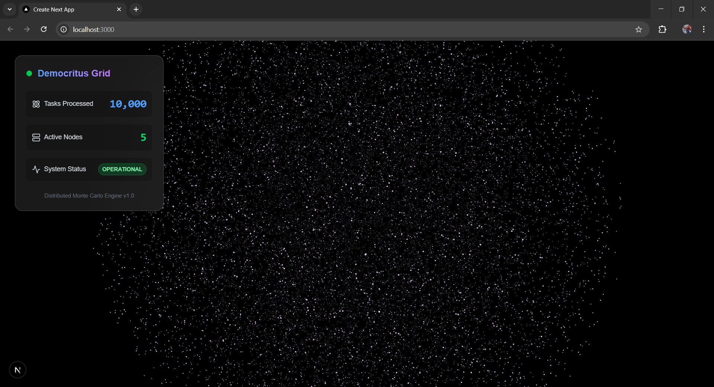

# Democritus: Distributed Monte Carlo Simulation Engine



**Democritus** is a high-performance, fault-tolerant distributed compute engine designed for running massive-scale Monte Carlo simulations. Built with a cloud-native architecture, it leverages a Master-Worker pattern to orchestrate thousands of concurrent physics calculations, visualizing the results in real-time through a 3D "God View" dashboard.

---

## 🏗 Architecture

The system follows a classic **Master-Worker** design pattern, encapsulated entirely within Docker containers for portability and scalability.

### 1. The Brain (Scheduler)
*   **Role**: Orchestrator.
*   **Responsibilities**:
    *   Manages the global Job Queue (10,000+ tasks).
    *   Dispatches tasks to Workers via **gRPC**.
    *   Handles Fault Tolerance: "Reaps" tasks from workers that timeout or crash, re-queueing them for other nodes.
    *   Exposes system metrics for observability.

### 2. The Muscle (Workers)
*   **Role**: Compute Nodes.
*   **Responsibilities**:
    *   Connects to the Scheduler (Swarm Intelligence).
    *   Executes the "Physics Core": A **3D Random Walk** simulation driven by seeded RNG for complete reproducibility.
    *   Stateless design allows for horizontal scaling (tested with 5-50 concurrent nodes).

### 3. The Senses (Observability & UI)
*   **Prometheus**: Scrapes real-time metrics (Tasks Completed/sec, Active Workers) from the Scheduler.
*   **Dashboard**: A **Next.js** application featuring a **Three.js (WebGL)** particle cloud that visualizes every completed simulation as a point in 3D space, updating in real-time.

---

## 🛠 Technology Stack

*   **Backend**: Golang (1.24)
*   **Communication**: gRPC (Protocol Buffers)
*   **Infrastructure**: Docker, Docker Compose
*   **Observability**: Prometheus
*   **Frontend**: Next.js (App Router), TypeScript, Tailwind CSS
*   **Visualization**: React Three Fiber (WebGL), Framer Motion

---

## 🚀 Getting Started

### Prerequisites
*   Docker & Docker Compose
*   Node.js & NPM (for Dashboard)

### 1. Launch the Engine
Start the Scheduler, Prometheus, and a cluster of 5 Workers.

```bash
docker compose up --build --scale worker=5
```

You will see the workers connect and begin crunching tasks immediately.

### 2. Launch the Dashboard
Open a new terminal to start the visualization interface.

```bash
cd dashboard
npm run dev
```

### 3. Access the Grid
*   **Dashboard (God View)**: [http://localhost:3000](http://localhost:3000)
*   **Prometheus (Metrics)**: [http://localhost:9090](http://localhost:9090)

---

## 📐 Key Features

*   **Cloud Native**: Fully containerized and ready for orchestration (Kubernetes compatible).
*   **Fault Tolerant**: The "Reaper" mechanism ensures 100% task completion even if worker nodes are killed randomly.
*   **High Performance**: Uses lightweight Goroutines and binary gRPC protocol for low-latency communication.
*   **Scientific Accuracy**: All simulations use seeded RNG, ensuring that any simulation can be perfectly replayed for auditability.

---

## 📜 License
MIT License.
